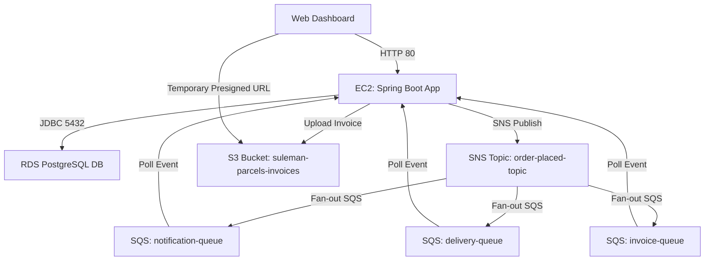

# Event-Driven Parcels Order System (TGTG PoC)

This project is a complete event-driven **Parcels Order System** (simulating the Too Good To Go architecture) built on a **Java 17 / Spring Boot** container and deployed to **Amazon Web Services (AWS)** using **Terraform (Infrastructure as Code)**.

---

## 🎯 Why This Project Exists

This project demonstrates production-grade backend design patterns:
1. **Event-Driven Architecture (EDA):** Utilizing **AWS SNS** (Publisher) and **AWS SQS** (Subscriber/Consumer) to implement async message fan-out across multiple services (Notifications, Invoices, Delivery).
2. **Cloud Storage & Temporary Security:** Storing dynamically generated documents in **AWS S3** and retrieving them via time-bounded **presigned URLs** to prevent public data exposure.
3. **Hexagonal Architecture (Ports & Adapters):** Keeping the core business logic independent of external databases, brokers, and cloud providers.
4. **Infrastructure as Code (IaC):** Provisioning S3, SQS, SNS, IAM roles, VPC, EC2, and RDS dynamically with Terraform.
5. **Secure compute permissions:** Using **IAM Instance Profiles** to grant permissions to the EC2 container host, completely avoiding hardcoded AWS access keys.

---

## 🏗️ Architecture Design

The architecture is provisioned in **AWS Stockholm (`eu-north-1`)** and uses IAM Instance Profiles to securely access resources without hardcoding keys:



* **VPC Layer:** A custom VPC (`10.0.0.0/16`) to isolate all computing resources.
* **Public Subnet:** Hosts the EC2 instance, allowing ingress HTTP (port 80) and restricted SSH (port 22) traffic.
* **Private Subnets:** Hosts the PostgreSQL database (RDS), completely shielded from direct internet access.
* **Security Groups:** 
  * The **EC2 Security Group** allows standard web traffic.
  * The **RDS Security Group** locks down database port 5432, allowing connections **only** from the EC2 security group.

---

## ⚙️ System Workflow & Lifecycle

The project follows a decoupled, 3-stage lifecycle representing professional cloud engineering practices:

### 1. Infrastructure Provisioning Stage (Terraform or Pulumi)
* **The Goal:** Define and provision the entire hosting network and resources before running any code.
* **Execution:** Run `terraform apply` (or `pulumi up`) to instruct AWS to create the Custom VPC, Subnets, Security Groups, IAM EC2 Instance Profiles, RDS Database, S3 Bucket, SQS Queues, and SNS Topics.
* **Output:** Generates the raw cloud endpoints (e.g., RDS endpoint, S3 Bucket ID, SNS Topic ARN) needed by the application.

### 2. Fully Managed Cloud Layer (AWS Managed Services)
* **Serverless Pub/Sub:** **SNS** (Simple Notification Service) acts as an event distributor. When an order is placed, it publishes an event which AWS automatically fans out to multiple **SQS** (Simple Queue Service) subscriber queues.
* **Serverless Storage:** **S3** (Simple Storage Service) securely holds generated invoices. Access is kept private, with downloads enabled via time-bounded presigned URLs.
* **Managed Database:** **RDS PostgreSQL** is fully managed by AWS (handling automated patching and backups), completely isolated inside the private subnet.

### 3. Application Deployment Stage (Docker & Bash Automation)
* **Execution:** Once the AWS environment is ready, the `deploy.sh` script compiles the Spring Boot code locally into a production JAR.
* **Containerization:** The JAR is copied over SSH to the EC2 host, compiled into a lightweight Docker image on-the-fly, and launched as an isolated container.
* **Secure Permissions:** The containerized app talks directly to AWS services using the EC2 instance profile, eliminating any hardcoded credentials in code.

---

## 📁 Project Structure

* **`app/`**: The Spring Boot Java application & Docker setup.
  * `src/main/java/com/suleman/poc/`: Structured using **Hexagonal Architecture (Ports and Adapters)**:
    * `domain/model/`: Pure Java domain models (`Order`, `OrderStatus`, `OrderPlacedEvent`), independent of any framework.
    * `domain/ports/`: Interfaces decoupling domain logic from inputs and outputs.
      * `inbound/`: Use cases triggered by external inputs (`ManageOrdersUseCase`).
      * `outbound/`: Interfaces for external operations (`OrderRepositoryPort`, `OrderEventPublisherPort`, `InvoiceStoragePort`).
    * `domain/service/`: Implementation of the core domain business logic (`OrderServiceImpl`).
    * `adapters/`: Concrete implementations of ports:
      * `web/`: Inbound adapter (REST controller) exposing order endpoints and serving the UI.
      * `persistence/`: Outbound adapter wrapping Spring Data JPA for PostgreSQL.
      * `messaging/`: SNS publishers and SQS queue consumers (Notifications, Invoices, Delivery).
      * `storage/`: Outbound adapter mapping invoice uploads and presigning links to S3.
  * `src/main/resources/static/index.html`: A premium glassmorphic tracking dashboard UI displaying live order states, real-time logging, and presigned S3 download links.
  * `Dockerfile`: Multi-stage Docker build definition.
  * `docker-compose.yml`: For local development and testing.
  * `deploy.sh`: Script automating local compilation, file copy, and EC2 remote container deployment.
* **`pulumi/`**: Infrastructure configuration using Pulumi (Python).
  * `Pulumi.yaml`: Project metadata configuration.
  * `Pulumi.dev.yaml`: Dev stack configurations (region details).
  * `requirements.txt`: Python package dependencies.
  * `__main__.py`: Complete infrastructure mapping in Python code.
* **`terraform/`**: Infrastructure configuration using Terraform (HCL).
  * `providers.tf`: AWS provider specification.
  * `variables.tf`: Input variables (region, CIDRs, DB credentials).
  * `vpc.tf`: Networking (VPC, Subnets, Internet Gateway, DB Subnet Group).
  * `security_groups.tf`: Inbound and outbound firewall rules.
  * `rds.tf`: Database instance specification.
  * `ec2.tf`: Virtual server provisioning and Docker auto-setup.
  * `outputs.tf`: Outputs public IP, base URL, and database endpoint.

---

## 🚀 How to Run and Deploy

### 1. Local Development (Docker Compose)
To run and test the complete application stack locally on your computer:
1. Navigate to the `app/` folder:
   ```bash
   cd app
   ```
2. Build and start the containers:
   ```bash
   docker compose up --build
   ```
3. Open your browser and go to `http://localhost:8080` to access the live dashboard.

---

### 2. AWS Production Deployment (Terraform)
To deploy the infrastructure and application to AWS:

#### Prerequisites
* Install Terraform.
* Install the AWS CLI.
* **AWS CLI Credentials Setup:** Follow the steps below to configure your credentials:

##### A. Create an IAM User
1. Log in to your [AWS Management Console](https://console.aws.amazon.com/).
2. Search for **IAM** in the top search bar and click on it.
3. In the left navigation pane, click **Users**, then click **Create user**.
4. Set a username (e.g., `developer-cli`) and click **Next**.
5. Choose **Attach policies directly**, search for **`AdministratorAccess`**, check it, and click **Next** then **Create user**.

##### B. Generate Access Keys
1. Click on the username of the newly created user.
2. Navigate to the **Security credentials** tab.
3. Scroll down to the **Access keys** section and click **Create access key**.
4. Choose **Command Line Interface (CLI)**, check the confirmation box at the bottom, and click **Next** then **Create access key**.
5. Download the `.csv` file containing the **Access Key ID** and **Secret Access Key** (keep them secure!).

##### C. Configure the AWS CLI locally
1. Open your local terminal and run:
   ```bash
   aws configure
   ```
2. Enter the values when prompted:
   * **AWS Access Key ID:** Paste your Access Key ID.
   * **AWS Secret Access Key:** Paste your Secret Access Key.
   * **Default region name:** `eu-north-1` (Stockholm, matching this project's default).
   * **Default output format:** `json`
3. Verify your setup:
   ```bash
   aws sts get-caller-identity
   ```

#### Provisioning Infrastructure
1. Navigate to the `terraform/` directory:
   ```bash
   cd terraform
   ```
2. Initialize Terraform and download the AWS providers:
   ```bash
   terraform init
   ```
3. Review the execution plan:
   ```bash
   terraform plan
   ```
4. Deploy the infrastructure (it will ask you to confirm by typing `yes`):
   ```bash
   terraform apply
   ```
5. Once complete, copy the output values (especially `ec2_public_ip` and `rds_endpoint`).

#### Deploying the Application
To deploy the infrastructure and application to AWS, we use a fully automated orchestration script `deploy.sh` that provisions the cloud resources using either **Terraform** or **Pulumi**, extracts endpoints, compiles the Java code, and runs the container on EC2:

1. Make sure you have configured your AWS CLI credentials (see Prerequisites above).
2. Navigate to the `app/` directory:
   ```bash
   cd app
   ```
3. Choose your preferred Infrastructure as Code (IaC) tool and run the deployment:
   * **To deploy via Terraform (Default):**
     ```bash
     chmod +x deploy.sh
     ./deploy.sh
     ```
   * **To deploy via Pulumi:**
     ```bash
     chmod +x deploy.sh
     ./deploy.sh --pulumi
     ```
4. The script will automatically:
   * Provision/update the cloud infrastructure via Terraform or Pulumi.
   * Dynamically query the newly generated EC2 IP, RDS host, and S3 bucket details.
   * Write and synchronize these values to your local `.env` configuration file.
   * Compile your Java Spring Boot application into a JAR.
   * Copy the build artifact to your EC2 host and deploy the Docker container live.

5. Open `http://<EC2-PUBLIC-IP>/` (the IP shown in the console output) in your browser to view your live tracking dashboard!

---

## 🧹 Cleaning Up Resources
To destroy all created resources and avoid any unexpected cloud charges:

* **If deployed via Terraform (Default):**
  1. Navigate to the `terraform/` directory:
     ```bash
     cd terraform
     ```
  2. Run the destroy command (confirm with `yes`):
     ```bash
     terraform destroy
     ```

* **If deployed via Pulumi:**
  1. Navigate to the `pulumi/` directory:
     ```bash
     cd pulumi
     ```
  2. Run the destroy command (confirm with `yes`):
     ```bash
     export PULUMI_CONFIG_PASSPHRASE="SecurePass123!"
     pulumi destroy --yes
     ```
