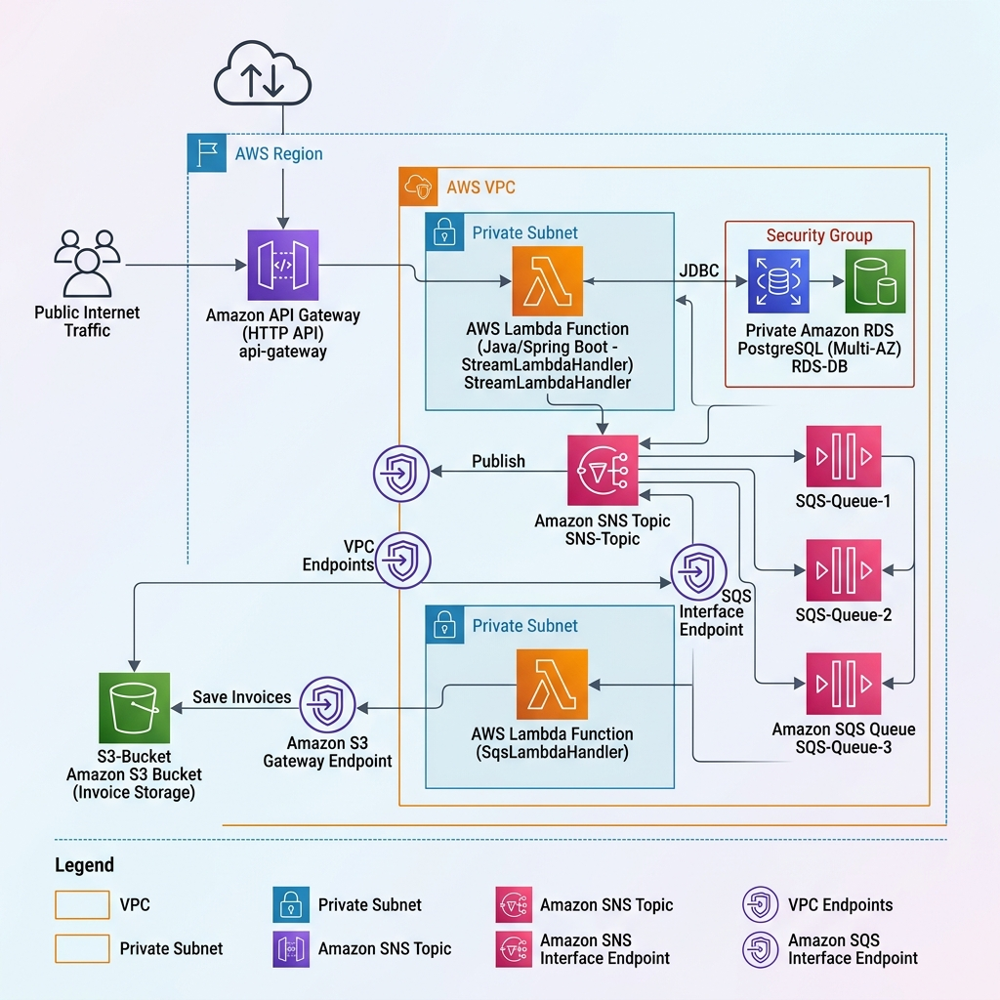

# Event-Driven Parcels Order System (TGTG Serverless PoC)

This project is a complete event-driven **Parcels Order System** (simulating the Too Good To Go backend architecture) migrated to a **Serverless Architecture** built on **Java 17 / Spring Boot** and deployed to **Amazon Web Services (AWS)** using **Terraform (HCL)** or **Pulumi (YAML)**.

---

## 🏗️ High-Level Serverless Architecture



The system utilizes a fully serverless approach:
- **API Gateway (HTTP API)** as the single public entrypoint routing REST requests into the REST API Lambda.
- **AWS Lambda (Java 17)** split into:
  - **API Lambda**: Executes web endpoints (order placement, history) via the `aws-serverless-java-container` servlet bridge.
  - **SQS Lambda**: Handles SQS triggers and routes incoming messages to their Spring bean consumers.
- **VPC Security & Zero-NAT Cost Savings**: The Lambdas run securely inside private VPC subnets to connect to the private Multi-AZ RDS database. To reach public AWS services (S3, SQS, SNS) without paying for a NAT Gateway, the VPC is configured with **S3 Gateway Endpoint** and **SQS/SNS Interface VPC Endpoints**.
- **Cold Start Optimization**: Both Lambda functions have **AWS Lambda SnapStart** enabled, which stores a snapshot of the initialized JVM memory to reduce cold start times to **under 1 second**.

---

## 🎯 Why This Project Exists

This repository demonstrates production-grade serverless backend design patterns and cloud infrastructure engineering:
1. **Event-Driven Architecture (EDA):** Utilizing **AWS SNS** (Publisher) and **AWS SQS** (Subscriber/Consumer) to implement asynchronous, loose-coupled message fan-out across multiple services (Notifications, Invoices, Delivery).
2. **Serverless Scaling**: AWS Lambda automatically scales up and down based on the traffic load, scaling to 0 when idle.
3. **Database Redundancy:** Running a **Multi-AZ PostgreSQL RDS** instance with synchronous replication to a standby instance in a separate Availability Zone (AZ) for automated failover.
4. **Cloud Storage & Temporary Security:** Storing dynamically generated documents in **AWS S3** and retrieving them via time-bounded **presigned URLs** to prevent public data exposure.
5. **Hexagonal Architecture (Ports & Adapters):** Keeping the core business logic independent of external databases, brokers, and cloud providers.
6. **Zero-NAT Endpoints**: Accessing S3, SQS, and SNS directly from private subnets through VPC Endpoints, saving up to $30+/month in NAT Gateway charges.

---

## 📁 Project Structure

* **`app/`**: The Spring Boot Java application.
  * `src/main/java/com/suleman/poc/`: Structured using **Hexagonal Architecture (Ports and Adapters)**:
    * `domain/model/`: Pure Java domain models (`Order`, `OrderStatus`, `OrderPlacedEvent`).
    * `domain/ports/`: Interfaces decoupling domain logic from inputs/outputs.
    * `domain/service/`: Implementation of core business logic.
    * `adapters/`: Concrete implementations of ports (REST, JPA, S3, SNS).
    * `StreamLambdaHandler.java`: Gateway proxy entrypoint for HTTP REST traffic.
    * `SqsLambdaHandler.java`: SQS trigger handler routing messages to SQS consumers.
  * `deploy.sh`: Script automating compilation and IaC deployment directly to Lambda.
* **`pulumi/`**: Infrastructure configuration using Pulumi (YAML).
  * `Pulumi.yaml`: The serverless infrastructure definition (VPC, Endpoints, Lambda functions, SQS event triggers, API Gateway, RDS).
* **`terraform/`**: Infrastructure configuration using Terraform (HCL).
  * `providers.tf`: AWS provider specification.
  * `vpc.tf`: Networking (VPC, Subnets, DB Subnet Group).
  * `security_groups.tf`: Security groups for Lambdas, RDS, and VPC endpoints.
  * `rds.tf`: Private database instance specification.
  * `lambda.tf`: VPC endpoints, Lambda functions, API Gateway HTTP API, SQS trigger mappings.
  * `outputs.tf`: Outputs the API Gateway endpoint.

---

## 🚀 How to Run and Deploy

### Prerequisites
* Install the AWS CLI and Terraform (or Pulumi).
* **AWS CLI Credentials Setup:** Configure your local terminal to access your AWS account:
  ```bash
  aws configure
  ```
  Verify your setup:
  ```bash
  aws sts get-caller-identity
  ```

---

### Deploying the Application

We use a fully automated deployment script `deploy.sh` that compiles the Spring Boot project and triggers the IaC application (automatically uploading/publishing the Lambda functions):

1. Navigate to the `app/` directory:
   ```bash
   cd app
   ```
2. Choose your preferred Infrastructure as Code (IaC) tool and run the deployment:
   * **To deploy via Terraform (Default):**
     ```bash
     chmod +x deploy.sh
     ./deploy.sh
     ```
   * **To deploy via Pulumi:**
     ```bash
     chmod +x deploy.sh
     ./deploy.sh --pulumi
     ```
3. The script will automatically:
   * Compile your Java Spring Boot application into a shaded JAR.
   * Run Terraform / Pulumi to provision the serverless infrastructure (VPC, Endpoints, RDS, API Gateway).
   * Deploy/update the Lambda functions with the newly compiled JAR file.
4. Open the **API Gateway URL** printed in your terminal output in your browser to view your live serverless tracking dashboard!

---

## 🧹 Cleaning Up Resources

To destroy all created resources and avoid any unexpected cloud charges:

* **If deployed via Terraform (Default):**
  1. Navigate to the `terraform/` directory:
     ```bash
     cd terraform
     ```
  2. Run the destroy command (confirm with `yes`):
     ```bash
     terraform destroy
     ```

* **If deployed via Pulumi:**
  1. Navigate to the `pulumi/` directory:
     ```bash
     cd pulumi
     ```
  2. Run the destroy command (confirm with `yes`):
     ```bash
     export PULUMI_CONFIG_PASSPHRASE="SecurePass123!"
     pulumi destroy --yes
     ```
